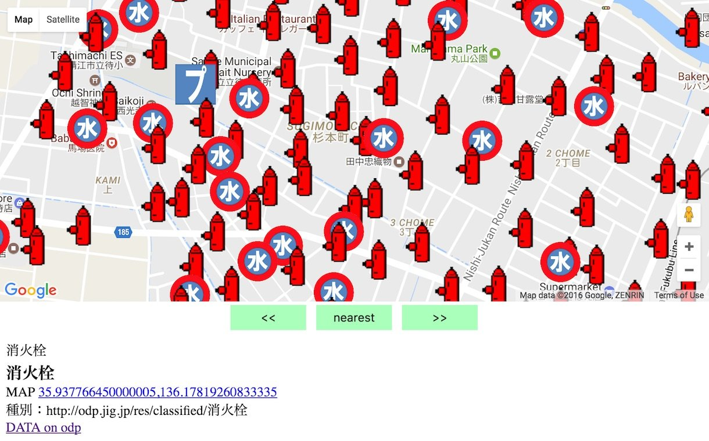

# findhydrant_fukuicity

> 日本語のREADMEはこちらです: [README.ja.md](README.ja.md)

A web application to locate fire hydrants in Fukui City, Japan, using open data from the city's official portal.

## Features

-   **Interactive Map:** Displays fire hydrant locations on a map using [Leaflet](https://leafletjs.com/) with map tiles from the [Geospatial Information Authority of Japan (GSI)](https://maps.gsi.go.jp/development/ichiran.html).
-   **Geolocation:** Automatically detects the user's location to show nearby hydrants.
-   **Nearest Hydrant Finder:** Calculates and sorts all hydrants by distance. A "Nearest" button instantly focuses on the closest one.
-   **Sorted Navigation:** Use "◀" and "▶" buttons to browse through hydrants in order of proximity.
-   **Dynamic Icons:** Uses distinct icons to classify water sources (e.g., public hydrant, private hydrant, water tank, pool).
-   **Detailed Information:** Click any